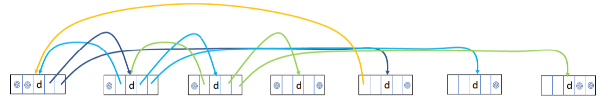

# Quadruply-Linked-List
Implements a variation of a linked list and to investigate its time complexity for some of the list operations.

## Implementation:
The List interface provides four methods for positional (indexed) access to list elements, two methods to search for a specified object, and two methods to insert and remove multiple elements at an arbitrary point in the list.

While some of these operations often execute in constant amount of time, the others may execute in time proportional to the index value, depending on the implementation (the LinkedList class, for example, is not very efficient when accessing elements in the middle of the list using an index, and ArrayList does not allow for efficient insertion or deletion, unless the element is at the end of the list).

In this project, we create quadruply-linked list-based partial implementation of the List interface. Unlike the existing java.util.LinkedList, our implementation will allow for faster traversal of the list. Specifically, the list nodes contains references to elements four positions forwards and backwards – if these exist, in addition to the common one position in each direction2 :

### Citations for code adoption:
- Sedgewick, R., Wayne, K. (2011). Algorithms, 4th Edition. Addison-Wesley. ISBN: 978-0-321-57351-3
- Goodrich, M. T., Tamassia, R. (2014). Data Structures and Algorithms in Java, 6th Edition. John Wiley & Sons. ISBN: 0-471-38367-8
